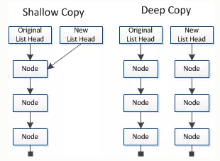

# 浅拷贝与深拷贝
## 数据类型
* 基本数据类型：直接存储在栈中的数据
    * String
    * Number
    * Boolean
    * Null
    * Undefined
    * Symbol
* 对象数据类型：存储的是该对象在栈中的引用，真实的数据存放在堆内存里
## 浅拷贝与深拷贝
* 只针对Object和Array这样的对象数据类型的
* 
    * 浅拷贝只复制指向某个对象的指针，而不复制对象本身，新旧对象还是共享同一块内存。
    * 深拷贝会另外创造一个一模一样的对象，新对象跟原对象不共享内存，修改新对象不会改到原对象。
## 浅拷贝实现方式
1. 直接赋值一个变量
    > [1.html](./1.html)
2. `Object.assign()`
    > [2.html](./2.html)
3. `Array.prototype.concat()`
    > [3.html](./3.html)
4. `Array.prototype.slice()`
    > [4.html](./4.html)
* 关于`Array`的`slice`和`concat`方法的补充说明：
    * `Array`的`slice`和`concat`方法不修改原数组，只会返回一个浅复制了原数组中的元素的一个新数组。
    * 原数组的元素会按照下述规则拷贝：
        * 如果该元素是个对象引用(不是实际的对象)，slice 会拷贝这个对象引用到新的数组里。两个对象引用都引用了同一个对象。如果被引用的对象发生改变，则新的和原来的数组中的这个元素也会发生改变。
        * 对于字符串、数字及布尔值来说（不是 String、Number 或者 Boolean 对象），slice 会拷贝这些值到新的数组里。在别的数组里修改这些字符串或数字或是布尔值，将不会影响另一个数组。
## 深拷贝实现方式
1. `JSON.parse(JSON.stringify())`
    > [5.html](./5.html)
    * 原理：用JSON.stringify将对象转成JSON字符串，再用JSON.parse()把字符串解析成对象，一去一来，新的对象产生了，而且对象会开辟新的栈，实现深拷贝。
    * 这种方法虽然可以实现数组或对象深拷贝，但不能处理函数。
        * 这是因为JSON.stringify() 方法是将一个JavaScript值(对象或者数组)转换为一个 JSON字符串，不能接受函数。
2、手写递归方法
    * 递归方法实现深度克隆原理：遍历对象、数组直到里边都是基本数据类型，然后再去复制。